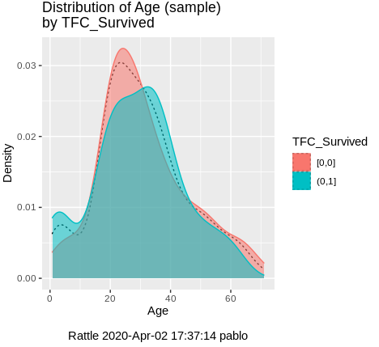
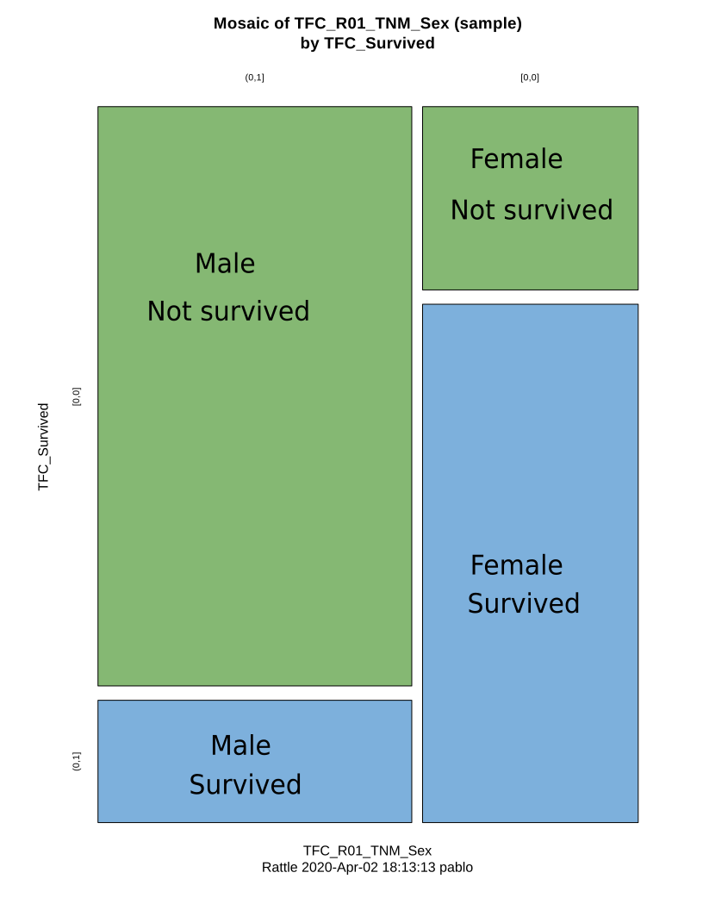

```{r setup, include=FALSE}
knitr::opts_chunk$set(echo = TRUE)
```

## Transforming the Kaggle data into data frames

The Kaggle API for command line was used to get the data to start this analysis.

After installing the Kaggle API (Kaggle API 1.5.6), from the comamnd line, following  <https://www.kaggle.com/docs/api>:

```
$ kaggle competitions download -c titanic
    Downloading titanic.zip to /home/pablo/Documents/Winter 2020/ENSF 611/Project/titanic
    0%|                                                   | 0.00/34.1k [00:00<?, ?B/s]
    100%|█████████████████████████████████
```

A new folder called `data/` was created under the project root directory and the file was moved there. The following R command inspects what's in the file without actually decompressing it.

```{r exploring zip file}
unzip("data/titanic.zip", list = TRUE)
```


Then the `.csv` files were extracted, stored in R compressed data format, `.rds`, for back up as invidivual sets of train and test sets, as well as a sample of how data must be submitted for scoring. Data frames were then populated with this data and supplied in memory for the exploratory phase.

```{r from zip file to data frames leaving a back up behind, echo=TRUE}
create_files <- function (fname,...) {
    try(expr = read.csv(unzip(zipfile = ..., files = c(fname))),silent = TRUE);
}

extract_file_names <- function (names) {
    setNames((unlist(strsplit(apply(names, MARGIN = c(1), function(r) r[1]), " "))), NULL)
}


create_df_from_zip_file <- function(file_name) {
    if(file.exists(file_name)) {
        files_from_kaggle <- unzip(file_name, list = TRUE)
        names <- extract_file_names(files_from_kaggle)
        dfs <- lapply(names, create_files, file_name)
        dfs
    }
}
```
The create a list of three data frames with the Kaggle data for the Titanic data analysis project

```{r creating the back up rds files}
dfs <- create_df_from_zip_file("data/titanic.zip")

if (dim(dfs[[1]])[2] == 2) { saveRDS(object = dfs[[3]], file = "data/sample_submission.rds")}
if (dim(dfs[[2]])[2] == 11) { saveRDS(object = dfs[[2]], file = "data/test.rds")}
if (dim(dfs[[3]])[2] == 12) { saveRDS(object = dfs[[3]], file = "data/train.rds")}

rm(dfs)
rm('create_files')
rm('extract_file_names')
rm('create_df_from_zip_file')
```

Now the data frames are generated from the backups.
```{r "train and test data frame creation from backups"}
titanic_train <- readRDS("data/train.rds")
titanic_test <- readRDS("data/test.rds")
out1<-paste0("Train data is ", dim(titanic_train)[1], " rows by ", dim(titanic_train)[2], " columns")
out2<-paste0("Test data is ", dim(titanic_test)[1], " rows by ", dim(titanic_test)[2], " columns")
print(out1)
print(out2)
```
This is the preallocated train/test split given by Kaggle.


## Data cleaning

Clean up all rows with mising values.

```{r remove missing values}
titanic_train_clean <- titanic_train[complete.cases(titanic_train), ]
dim(titanic_train_clean)
titanic_test_clean <- titanic_test[complete.cases(titanic_test), ]
dim(titanic_test_clean)
```

As a result of removing all records with any `NA` there was a reduction of 
`r dim(titanic_train)[1]-dim(titanic_train_clean)[1]` records in the train set.
Similarly, `r dim(titanic_test)[1]-dim(titanic_test_clean)[1]` records were removed from the test data set.

## Data exploration

Using the R package `rattle` [@WilliamsGraham2011DMwR], some basic statistics were observed.

The actual proportion of passengers that died according to [@Wikipedia.titanic.passengers] was `r 1496/2208 * 100`, the training data has a casualty ratio of `r 196/(196+133) * 100`. 
The distribution by age and the fraction by gender can be seen int he two plots below.


```{r pressure, echo=FALSE, out.width='50%'}

```

```{r echo=FALSE, out.width='60%'}
#
knitr::include_graphics('./img/Rattle-HistSurvivedByGender.png')
```


<!-- Note that the `echo = FALSE` parameter was added to the code chunk to prevent printing of the R code that generated the plot. -->


# References
