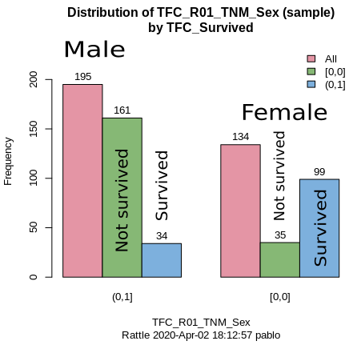

```{r setup, include=FALSE}
knitr::opts_chunk$set(echo = TRUE)
```

## Transforming the Kaggle data into data frames

The Kaggle API for command line was used to get the data to start this analysis.

After installing the Kaggle API (Kaggle API 1.5.6), from the comamnd line, following  <https://www.kaggle.com/docs/api>:

```
$ kaggle competitions download -c titanic
    Downloading titanic.zip to /home/pablo/Documents/Winter 2020/ENSF 611/Project/titanic
    0%|                                                   | 0.00/34.1k [00:00<?, ?B/s]
    100%|█████████████████████████████████
```

A new folder called `data/` was created under the project root directory and the file was moved there. The following R command inspects what's in the file without actually decompressing it.

```{r exploring zip file}
unzip("data/titanic.zip", list = TRUE)
```


Then the `.csv` files were extracted, stored in R compressed data format, `.rds`, for back up as invidivual sets of train and test sets, as well as a sample of how data must be submitted for scoring. Data frames were then populated with this data and supplied in memory for the exploratory phase.

```{r from zip file to data frames leaving a back up behind, echo=TRUE}
create_files <- function (fname,...) {
    try(expr = read.csv(unzip(zipfile = ..., files = c(fname))),silent = TRUE);
}

extract_file_names <- function (names) {
    setNames((unlist(strsplit(apply(names, MARGIN = c(1), function(r) r[1]), " "))), NULL)
}


create_df_from_zip_file <- function(file_name) {
    if(file.exists(file_name)) {
        files_from_kaggle <- unzip(file_name, list = TRUE)
        names <- extract_file_names(files_from_kaggle)
        dfs <- lapply(names, create_files, file_name)
        dfs
    }
}
```
The create a list of three data frames with the Kaggle data for the Titanic data analysis project

```{r creating the back up rds files}
dfs <- create_df_from_zip_file("data/titanic.zip")

if (dim(dfs[[1]])[2] == 2) { saveRDS(object = dfs[[3]], file = "data/sample_submission.rds")}
if (dim(dfs[[2]])[2] == 11) { saveRDS(object = dfs[[2]], file = "data/test.rds")}
if (dim(dfs[[3]])[2] == 12) { saveRDS(object = dfs[[3]], file = "data/train.rds")}

rm(dfs)
rm('create_files')
rm('extract_file_names')
rm('create_df_from_zip_file')
```

Now the data frames are generated from the backups.
```{r "train and test data frame creation from backups"}
titanic_train <- readRDS("data/train.rds")
titanic_test <- readRDS("data/test.rds")
out1<-paste0("Train data is ", dim(titanic_train)[1], " rows by ", dim(titanic_train)[2], " columns")
out2<-paste0("Test data is ", dim(titanic_test)[1], " rows by ", dim(titanic_test)[2], " columns")
print(out1)
print(out2)
```
This is the preallocated train/test split given by Kaggle.


## Data cleaning

Clean up all rows with mising values.

```{r remove missing values}
titanic_train_clean <- titanic_train[complete.cases(titanic_train), ]
dim(titanic_train_clean)
titanic_test_clean <- titanic_test[complete.cases(titanic_test), ]
dim(titanic_test_clean)
```

As a result of removing all records with any `NA` there was a reduction of 
`r dim(titanic_train)[1]-dim(titanic_train_clean)[1]` records in the train set.
Similarly, `r dim(titanic_test)[1]-dim(titanic_test_clean)[1]` records were removed from the test data set.

## Data exploration

Using the R package `rattle` [@WilliamsGraham2011DMwR], some basic statistics were observed.

The actual proportion of passengers that died according to [@Wikipedia.titanic.passengers] was `r format(round(1496/2208 * 100, 2), nsmall = 2)`, the training data has a casualty ratio of `r format(round(196/(196+133) * 100, 2), nsmall=2)`. 
The distribution by age and the fraction by gender can be seen int he two plots below.

```{r "Age distribution by survival", echo=FALSE}
library(ggplot2)
theme_set(theme_classic())
g <- ggplot(titanic_train_clean, aes(x=Survived, y=Age, fill= Sex)) +
    geom_bar(stat="identity", width = 0.75, position = "dodge") +
    labs(title = "Bar plot for age and survivor status",subtitle = "Discriminated by gender")
plot(g)
```


```{r echo=FALSE, out.width='60%'}

```

A clustering analysis with KMeans and two clusters, one with 302 passengers and a second one with 27. Between the two they explain 71.12% of the point variability of the data.
The cluster centers are:

       Age     SibSp     Parch      Fare
1 30.11947 0.5430464 0.3874172  23.81876
2 33.10815 0.7037037 1.0740741 174.72669

Their plot appear below:

```{r echo=FALSE, out.width='60%'}
knitr::include_graphics('./img/Rattle-KMeansclustering.png')
```

These clusters may indicate that there are data does naturally separate in two groups but the meaning of these clusters isn't very clear. Another analysis shows that the number of clusters stabilizes after approximately 5.

### Exploration with a generalized linear model

Using the `rattle` package a quick generalize linear model with the `probit` function showed how the statistically significant coefficients were those of the variables:

    1. `SibSp`: number of siblings and/or spouse
    2. `Age`
    3. `TFC_Pclass(1,2]`: first class passengers
    4. `TFC_Pclass(2,3] : second class passengers
    5. `TFC_R01_TNM_Sex(0,1]`: the gender of the passenger, 0 for female, 1 for male    
    

```
Summary of the Probit Regression model (built using glm):

Call:
glm(formula = TFC_Survived ~ ., family = binomial(link = "probit"), 
    data = crs$dataset[crs$train, c(crs$input, crs$target)])

Deviance Residuals: 
    Min       1Q   Median       3Q      Max  
-2.2590  -0.7393  -0.3666   0.5816   2.5985  

Coefficients:
                        Estimate  Std. Error z value   Pr(>|z|)    
(Intercept)            5.5917216 146.9544573   0.038    0.96965    
Age                   -0.0199283   0.0067510  -2.952    0.00316 ** 
SibSp                 -0.2234184   0.1020782  -2.189    0.02862 *  
Parch                 -0.0370586   0.1216786  -0.305    0.76070    
Fare                  -0.0001906   0.0024013  -0.079    0.93672    
EmbarkedC             -3.3562126 146.9542888  -0.023    0.98178    
EmbarkedQ             -2.8990208 146.9549656  -0.020    0.98426    
EmbarkedS             -3.3481248 146.9542837  -0.023    0.98182    
TFC_Pclass(1,2]       -0.6508577   0.2950677  -2.206    0.02740 *  
TFC_Pclass(2,3]       -1.3804582   0.3034635  -4.549 0.00000539 ***
TFC_R01_TNM_Sex(0,1]  -1.6522252   0.1792327  -9.218    < 2e-16 ***
---
Signif. codes:  0 '***' 0.001 '**' 0.01 '*' 0.05 '.' 0.1 ' ' 1
```

### Numerical variables

The input numerical variables are `Age`, `SibSp`, `Parch`, and `Fare`.
The variables `SibSp`, the number od siblings and spouses, can be treated as acontinuous value between 0 and the max observed in the data, 5.


The variable `Age` has a distribution that is centered around central values so a min max scaler could be appropriate to aid some of the predictors deal with different scales among variables.


```{r "Age distribution", echo=FALSE}
library(ggplot2)
theme_set(theme_classic())
g <- ggplot(titanic_train_clean, aes(Age)) +
    geom_density(aes(fill=Sex), alpha=0.8) +
    labs(title = "Density plot for Age",subtitle = "Discriminated by gender")
plot(g)
```

```{r "SibSp distribution", echo=FALSE}
hist(titanic_train_clean$SibSp)
```
It also shows high values for skewness 2.265915 and kurtosis 5.217676. This indicates that this variable needs to be scaled with a standard scaler.

`Parch`, the number of parents and children accompanying the passenger, can also be treated as a continuous independent variable.

```{r "Parch distribution", echo=FALSE}
hist(titanic_train_clean$Parch)
```
As the histogram shows and the values of skewness 1.836532 kurtosis 3.152783 indicate it should also be normalized with a standard scaler.

Finaly `Fare` shows a very skewed distribution towards the low values. This is confirmed by the statistics of the variable: a mean of 36.20, a median of 16.70, a standard deviation of 52.52, skeness 4.050455, and kurtosis 24.262948. Therefore a standard scaler is th recommended preprocessing.

```{r "Fare distribution", echo=FALSE}
hist(titanic_train_clean$Fare)
```


### Categorical variables 

The input categorical variables are `Sex` for gender Female (0) or Male (1), `Pclass` for the passenger category assigned by the shipping company, 1st, 2nd, or 3rd, en encoded as 1, 2 or 3, and treated as a continuous variable here that will be normalized with min max.

The dependent or predicted variable is `Survived` that takes 196 (59.6%) negative outcomes  represented as 0 and 133 (40.4%) positive results represented as 1. 


## Distributions


# Model building


## Decision tree


# References
