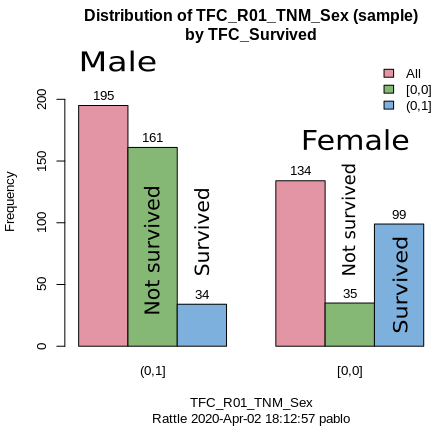
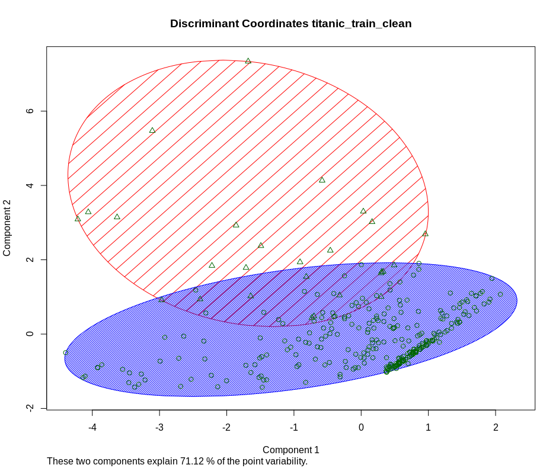

```{r setup, include=FALSE}
knitr::opts_chunk$set(echo = TRUE)
```

## Transforming the Kaggle data into data frames

The Kaggle API (API v.1.5.6)for command line was used to get the data to start this analysis. 
The files downloaded from the site were decompressed and stored for backup as three different files, one for training, one ofr test, and another with a sample submission.

```{r "exploring zip file", message=FALSE, warning=FALSE, include=FALSE, paged.print=FALSE}
unzip("data/titanic.zip", list = TRUE)
```

```{r "from zip file to data frames leaving a back up behind", message=FALSE, warning=FALSE, include=FALSE, paged.print=FALSE}
create_files <- function (fname,...) {
    try(expr = read.csv(unzip(zipfile = ..., files = c(fname))),silent = TRUE);
}

extract_file_names <- function (names) {
    setNames((unlist(strsplit(apply(names, MARGIN = c(1), function(r) r[1]), " "))), NULL)
}


create_df_from_zip_file <- function(file_name) {
    if(file.exists(file_name)) {
        files_from_kaggle <- unzip(file_name, list = TRUE)
        names <- extract_file_names(files_from_kaggle)
        dfs <- lapply(names, create_files, file_name)
        dfs
    }
}
```

```{r "creating the back up rds files", message=FALSE, warning=FALSE, include=FALSE, paged.print=FALSE}
dfs <- create_df_from_zip_file("data/titanic.zip")

if (dim(dfs[[1]])[2] == 2) { saveRDS(object = dfs[[3]], file = "data/sample_submission.rds")}
if (dim(dfs[[2]])[2] == 11) { saveRDS(object = dfs[[2]], file = "data/test.rds")}
if (dim(dfs[[3]])[2] == 12) { saveRDS(object = dfs[[3]], file = "data/train.rds")}

rm(dfs)
rm('create_files')
rm('extract_file_names')
rm('create_df_from_zip_file')
```


```{r "train and test data frame creation from backups", message=FALSE, warning=FALSE, include=FALSE, paged.print=FALSE}
titanic_train <- readRDS("data/train.rds")
titanic_test <- readRDS("data/test.rds")
out1<-paste0("Train data is ", dim(titanic_train)[1], " rows by ", dim(titanic_train)[2], " columns")
out2<-paste0("Test data is ", dim(titanic_test)[1], " rows by ", dim(titanic_test)[2], " columns")
print(out1)
print(out2)
```

The way the data was given by Kaggle made it difficult to change the proportion of data in the train and test sets.


## Data cleaning


```{r remove missing values, message=FALSE, warning=FALSE, include=FALSE, paged.print=FALSE}
titanic_train_clean <- titanic_train[complete.cases(titanic_train), ]
dim(titanic_train_clean)
```
All the rows with mising values were removed. As a result, there was a reduction of 
`r dim(titanic_train)[1]-dim(titanic_train_clean)[1]` records in the train set.


## Data exploration

The actual proportion of passengers that died according to [@Wikipedia.titanic.passengers] was `r format(round(1496/2208 * 100, 2), nsmall = 2)`%, the training data has a non-survival proportion of `r format(round(196/(196+133) * 100, 2), nsmall=2)`%. It is close but the sampling did not consider this proportion.

```{r "Age distribution by survival", echo=FALSE, message=FALSE, warning=FALSE, paged.print=FALSE}
library(ggplot2)
theme_set(theme_classic())
g <- ggplot(titanic_train_clean, aes(x=Survived, y=Age, fill= Sex)) +
    geom_bar(stat="identity", width = 0.75, position = "dodge") +
    labs(title = "Bar plot for age and survivor status",subtitle = "Discriminated by gender")
plot(g)
rm(g)
```


```{r eval=FALSE, message=FALSE, warning=FALSE, include=FALSE, out.width='60%', paged.print=FALSE}

```

A clustering analysis with KMeans and two clusters, one with 302 passengers and a second one with 27. Between the two they explain 71.12% of the point variability of the data.
The cluster centers are:

       Age     SibSp     Parch      Fare
1 30.11947 0.5430464 0.3874172  23.81876
2 33.10815 0.7037037 1.0740741 174.72669

Their plot appear below:

```{r echo=FALSE, out.width='60%'}

```

These clusters may indicate that there are data does naturally separate in two groups but the meaning of these clusters isn't very clear. Another analysis shows that the number of clusters stabilizes after approximately 5. This suggests that there is potential for dimensionality reduction, maybe using PCA. This was not pursued in the course of this analysis.


### Exploration with a generalized linear model

Using a generalize linear model with the `probit` function showed the coefficient of the following variables were statistically significant:

    1. `SibSp`: number of siblings and/or spouse
    2. `Age`
    3. `Pclass`: the passengers class
    4. `Sex`: the gender of the passenger
  

### Numerical variables

The input numerical variables are `Age`, `SibSp`, `Parch`, and `Fare`.

`Age` has a relatively centered distribution.

```{r "Age distribution", echo=FALSE, message=FALSE, warning=FALSE, paged.print=FALSE}
library(ggplot2)
theme_set(theme_classic())
g <- ggplot(titanic_train_clean, aes(Age)) +
    geom_density(aes(fill=Sex), alpha=0.8) +
    labs(title = "Density plot for Age",subtitle = "Discriminated by gender")
plot(g)
```

The variable `SibSp`, the number of siblings and spouse, can be treated as a continuous value between 0 and the maximum observed in the data, 5.

```{r "SibSp distribution", echo=FALSE, message=FALSE, warning=FALSE, paged.print=FALSE}
hist(titanic_train_clean$SibSp)
```
It also shows high values for skewness 2.265915 and kurtosis 5.217676. This indicates that this variable needs to be scaled with a standard scaler.


`Parch`, the number of parents and children accompanying the passenger, can also be treated as a continuous predictor.

```{r "Parch distribution", echo=FALSE, message=FALSE, warning=FALSE, paged.print=FALSE}
hist(titanic_train_clean$Parch)
```

As the histogram shows and the values of skewness 1.836532 kurtosis 3.152783 indicate it should also be normalized with a standard scaler.

Finally, `Fare` shows a very skewed distribution towards the low values. This is confirmed by the statistics of the variable: a mean of 36.20, a median of 16.70, a standard deviation of 52.52, skeness 4.050455, and kurtosis 24.262948. Therefore a standard scaler is th recommended preprocessing.

```{r "Fare distribution", echo=FALSE}
hist(titanic_train_clean$Fare)
```


### Categorical variables 

The input categorical variables are `Sex` for gender Female (0) or Male (1), `Pclass` for the passenger category assigned by the shipping company, 1st, 2nd, or 3rd, and thus assigned three levels or factors.

The dependent or predicted variable is `Survived` that takes 196 (59.6%) negative outcomes, represented as 0, and 133 (40.4%) positive results, represented as 1. 


## Preprocessing

Only the numerical variables identified in the previous section were normalized. The same normalization used on the training set was used to predict with the test set for consistency. The predictor does not need any normalization.

```{r "standarization", message=FALSE, warning=FALSE, include=FALSE, paged.print=FALSE}
library(caret)
preObj <- preProcess(titanic_train_clean[,c("Age","SibSp","Parch","Fare")], method = c("center","scale", "BoxCox", "knnImpute"))
```

To avoid missing predictions due to missing values in `Age` in the test set, I used K-nearest neighbours imputation as part of the preprocessing. This method with _k=10_ finds the 10 nearest data vectors that look most like the data vector with the missing value and fills it in with the average from the cluster at that position.  This gave slightly better results that not using this predictor at all to train the models. This restriction came from Kaggle requiring submissions for all records of the test set.


### Preparing the data set to train the  models

```{r "preparing the training data set for model building", message=FALSE, warning=FALSE, include=FALSE, paged.print=FALSE}
# sibsbstd <- predict(preObj, titanic_train_clean[,c(6,7,8,9)])$SibSp
titanic_train_transformed <- predict(preObj, newdata = titanic_train_clean[,c("Age","SibSp","Parch","Fare")])
titanic_train_scaled <- cbind(titanic_train_clean[,c("PassengerId","Pclass","Sex","Embarked", "Survived")], titanic_train_transformed)
titanic_train_scaled$Survived <- as.factor(titanic_train_scaled$Survived)
titanic_train_scaled$Pclass <- as.factor(titanic_train_scaled$Pclass)
```
The variables `Name` and `Cabin` were dropped from this data frame because they hold very little meaning for prediction.
The other variables mentioned in the previous sections were included in the data frame.


### Preparing the data set for prediction

The test set was transformed in the same fashion as the training set, in this case using the same procedure with centering around the mean and scaling using the standard deviation.


```{r "preparing the test set for prediction", message=FALSE, warning=FALSE, include=FALSE, paged.print=FALSE}
titanic_test_transformed <- predict(preObj, titanic_test[,c("Age","SibSp","Parch","Fare")])
titanic_test_scaled <- cbind(titanic_test[,c("PassengerId","Pclass","Sex","Embarked")], titanic_test_transformed)
titanic_test_scaled$Pclass <- as.factor(titanic_test_scaled$Pclass)
```

# Building and scoring the models

The emphasis will be on models that tradionally score well in classification competitions, that are insensitive to outliers and that are ensemble methods for structured data. In general repeated cross validation with 10 groups and 3 repetitions was used as often as practical. Parallel processing was enabled also to speed up the fitting.

Once each model is fitted to the training data a prediction is made with the test data and the result is saved to a `.csv` file in the folder for the results to be submitted to Kaggle. The score obtained from them is reported.


## Logistic Model Trees

```{r "logistic model trees", echo=FALSE, message=FALSE, warning=FALSE}
set.seed(112233)
library(parallel) 
num_cores <- detectCores() - 1
library(doParallel)
cl <- makePSOCKcluster(num_cores)
registerDoParallel(cl)

LMT_model <- train(form = Survived ~ .,
                   data = titanic_train_scaled,
                   trControl= trainControl(method = "repeatedcv", number=10, repeats = 3, allowParallel = TRUE),
                   method = "LMT")
stopCluster(cl); registerDoSEQ()
LMT_model
```
The accuracy on the training set was `r LMT_model$results$Accuracy[-1]` with Kappa of `r LMT_model$results$Kappa[-1]`.

```{r "preparing logistic model trees for submission to Kaggle", message=FALSE, warning=FALSE, include=FALSE, paged.print=FALSE}
survived_pred_lmt<- predict(LMT_model, newdata = titanic_test_scaled)
survived_pred_lmt<- ifelse(survived_pred_lmt
                          == 1, "0", "1")
lmt_to_kaggle <- data.frame(PassengerId=titanic_test_scaled$PassengerId,
                            Survived=survived_pred_lmt,
                            stringsAsFactors = TRUE)
write.csv(lmt_to_kaggle, file = "results/lmt_default.csv", row.names=FALSE)
```

This result received a score of `0.23444` in Kaggle.


## Bayesian generalized linear model


```{r "bayesglm regression", echo=FALSE, message=FALSE, warning=FALSE}
set.seed(112233)
library(parallel) 
num_cores <- detectCores() - 1
library(doParallel)
cl <- makePSOCKcluster(num_cores)
registerDoParallel(cl)

bayes_glm <- train(form = Survived ~ .,
                   data = titanic_train_scaled,
                   trControl= trainControl(method = "repeatedcv", number=10, repeats = 3, allowParallel = TRUE),
                   method = "bayesglm")
stopCluster(cl); registerDoSEQ()
bayes_glm
```
The accuracy on the training set was `0.7868` with a Kappa value of `0.5538`.

```{r "preparing bayesglm for submission to Kaggle", message=FALSE, warning=FALSE, include=FALSE, paged.print=FALSE}
survived_pred_bayes_glm <- predict(bayes_glm, newdata = titanic_test_scaled)
survived_pred_bayes_glm <- ifelse(survived_pred_bayes_glm == 1, "0", "1")
bayes_glm_to_kaggle <- data.frame(PassengerId=titanic_test_scaled$PassengerId,
                                    Survived=survived_pred_bayes_glm,
                                    stringsAsFactors = TRUE)
write.csv(bayes_glm_to_kaggle, file = "results/bayes_glm.csv", row.names=FALSE, append = FALSE)
```

This result received a score of `0.33971` in Kaggle.


## Generalized linear model 

```{r "logistic regression", echo=FALSE, message=FALSE, warning=FALSE, paged.print=FALSE}
set.seed(112233)
default_glm_mod = train(form = Survived ~ .,
                        data = titanic_train_scaled,
                        trControl= trainControl(method = "repeatedcv", number=10, repeats = 3, allowParallel = TRUE),
                        method = "glm",
                        family = "binomial")

default_glm_mod
```

This model shows and accuracy of `r default_glm_mod$results$Accuracy` on the training set.

```{r "preparing logit for submission to Kaggle", include=FALSE}
survived_pred_glm <- predict(default_glm_mod, newdata = titanic_test_scaled)
survived_pred_glm <- ifelse(survived_pred_glm == 1, "0", "1")
glm_default_to_kaggle <- data.frame(PassengerId=titanic_test_scaled$PassengerId,
                                    Survived=survived_pred_glm,
                                    stringsAsFactors = TRUE)
write.csv(glm_default_to_kaggle, file = "results/glm_default.csv", row.names=FALSE, append = FALSE)
```
The logistic regression model got a score of `0.24401` on Kaggle.


## xGBoost

A default XGBoost model was built and some hyperparameter exploration was done only for the learning rate (the step size for the gradient estimation) and for the maximum depth of the trees. This took too long so several attempts at doing a grid optimization were abandoned.  I think I need more experience with this method.

```{r "default xGBoost model", echo=FALSE}
set.seed(112233)
library(parallel) 
num_cores <- detectCores() - 1
library(doParallel)
cl <- makePSOCKcluster(num_cores)
registerDoParallel(cl)

grid_default <- expand.grid(
  nrounds = 100,
  max_depth = 4,
  eta = 0.025,
  gamma = 0,
  colsample_bytree = 1,
  min_child_weight = 1,
  subsample = 1
)

train_control <- caret::trainControl(
  method = "none",
  verboseIter = FALSE, # no training log
  allowParallel = TRUE # FALSE for reproducible results 
)

xgb_base <- caret::train(
  form = Survived ~ ., 
  data = titanic_train_scaled,
  trControl = train_control,
  tuneGrid = grid_default,
  method = "xgbTree",
  verbose = TRUE
)
stopCluster(cl); registerDoSEQ()
xgb_base$bestTune
```


```{r "preparing xgboost for submission to Kaggle", include=FALSE}
survived_pred_xgb <- predict(xgb_base, newdata = titanic_test_scaled)
survived_pred_xgb <- ifelse(survived_pred_xgb == 1, "0", "1")
xgb_default_to_kaggle <- data.frame(PassengerId=titanic_test_scaled$PassengerId,
                                    Survived=survived_pred_xgb,
                                    stringsAsFactors = TRUE)
write.csv(xgb_default_to_kaggle, file = "results/xgb_default.csv", row.names=FALSE, append = FALSE)
```

These results obtained a score of `0.21531` on Kaggle.


## Random forests

```{r default random forest, echo=FALSE}
set.seed(112233)
library(parallel) 
# Calculate the number of cores
num_cores <- detectCores() - 1

library(doParallel)
cl <- makePSOCKcluster(num_cores)
registerDoParallel(cl) 

default_rf_mod <- train(form = Survived ~ ., 
                        data = titanic_train_scaled,
                        method = "rf",
                        prox = TRUE)
stopCluster(cl); registerDoSEQ()
default_rf_mod
```                        

```{r "preparing random forest for submission to Kaggle", include=FALSE}
survived_pred_rf <- predict(default_rf_mod, newdata = titanic_test_scaled)
survived_pred_rf <- ifelse(survived_pred_rf == 1, "0", "1")
rf_default_to_kaggle <- data.frame(PassengerId=titanic_test_scaled$PassengerId,
                                    Survived=survived_pred_rf,
                                    stringsAsFactors = TRUE)
write.csv(rf_default_to_kaggle, file = "results/rf_default.csv", row.names=FALSE, append = FALSE)
```

The results form this model received a Kaggle score of `0.22966`.


## Random forest with cross validation

```{r default random forest loocv, echo=FALSE}
set.seed(112233)
library(parallel) 
# Calculate the number of cores
num_cores <- detectCores() - 1

library(doParallel)
cl <- makePSOCKcluster(num_cores)
registerDoParallel(cl) 

default_rfcv_mod <- train(form = Survived ~ ., 
                        data = titanic_train_scaled,
                        method = "rf",
                        trControl= trainControl(method = "LOOCV", p = 0.1, allowParallel = TRUE),
                        prox = TRUE)
stopCluster(cl); registerDoSEQ()
default_rfcv_mod
```                        

The random forest grown with _leave one out cross validation_ for the splitting on variables while growing trees, produces an accuracy of `r default_rfcv_mod$results$Accuracy[-1]` on the training set. However this translates into a Kaggle score of `0.22966`, identical to the one obtained for the regular random forest.

```{r "preparing random forest loocv for submission to Kaggle", include=FALSE}
survived_pred_rfloocv <- predict(default_rf_mod, newdata = titanic_test_scaled)
survived_pred_rfloocv <- ifelse(survived_pred_rfloocv == 1, "0", "1")
rfloocv_default_to_kaggle <- data.frame(PassengerId=titanic_test_scaled$PassengerId,
                                    Survived=survived_pred_rfloocv,
                                    stringsAsFactors = TRUE)
write.csv(rfloocv_default_to_kaggle, file = "results/rf_loocv_default.csv", row.names=FALSE, append = FALSE)
```


## Support Vector Machine with Linear kernel


```{r support vector machine svmLinear default, echo=FALSE}
set.seed(112233)
library(parallel) 
# Calculate the number of cores
num_cores <- detectCores() - 1

library(doParallel)
cl <- makePSOCKcluster(num_cores)
registerDoParallel(cl) 

default_svm_linear <- train(form = Survived ~ ., 
                        data = titanic_train_scaled,
                        method = "svmLinear",
                        trControl= trainControl(method = "repeatedcv", number=10, repeats = 3, allowParallel = TRUE),
                        tuneLength = 10)
stopCluster(cl); registerDoSEQ()
default_svm_linear

```
The training accuracy was `r default_svm_linear$results$Accuracy` with the linear kernel.

```{r "preparing svm linear kernel for submission to Kaggle", include=FALSE}
survived_pred_svmLin <- predict(default_svm_linear, newdata = titanic_test_scaled)
survived_pred_svmLin <- ifelse(survived_pred_svmLin == 1, "0", "1")
svmlinear_default_to_kaggle <- data.frame(PassengerId=titanic_test_scaled$PassengerId,
                                    Survived=survived_pred_svmLin,
                                    stringsAsFactors = TRUE)
write.csv(svmlinear_default_to_kaggle, file = "results/svmlinear_default.csv", row.names=FALSE, append = FALSE)
```
The results from this model produced a score of `0.23444` in Kaggle.


## Support Vector Machine with least squares Radial kernel.

This option has the Radial Basis Function kernel and sigma and cost as the hyperparameters to tune.

```{r support vector machine lssvmRadial default, echo=FALSE}
set.seed(112233)
library(parallel) 
# Calculate the number of cores
num_cores <- detectCores() - 1

library(doParallel)
cl <- makePSOCKcluster(num_cores)
registerDoParallel(cl) 

default_svm_lsRadial <- train(form = Survived ~ ., 
                        data = titanic_train_scaled,
                        method = "lssvmRadial",
                        trControl= trainControl(method = "repeatedcv", number=10, repeats = 3, allowParallel = TRUE),
                        tuneLength = 10)
stopCluster(cl); registerDoSEQ()
default_svm_lsRadial

```
The training accuracy was `r default_svm_linear$results$Accuracy[-1]` with the linear kernel.

```{r "preparing svm least square support Radial Basis Kernel for submission to Kaggle", include=FALSE}
survived_pred_svmlsR <- predict(default_svm_lsRadial, newdata = titanic_test_scaled)
survived_pred_svmlsR <- ifelse(survived_pred_svmlsR == 1, "0", "1")
svm_lsradial_default_to_kaggle <- data.frame(PassengerId=titanic_test_scaled$PassengerId,
                                    Survived=survived_pred_svmlsR,
                                    stringsAsFactors = TRUE)
write.csv(svm_lsradial_default_to_kaggle, file = "results/svm_lsRadial_default.csv", row.names=FALSE, append = FALSE)
```

These predictions got `0.23923` in Kaggle.


## Conclusions

The Kaggle titanic training set is quite challenging if one really wishes to score high on the leaderboard.

My perception is that it requires more thought into understanding the way the predictors, both categorical and continuous affect the prediction. Most of the implementations used automatically treat the categorical predictors like the tree based methods or convert them into numerica variables using hot-encoding or binary encoding as factors.

Some of the variables are not very balanced and this can cause problems.

I did not have the opportunity of doing more systematic hyperparameter tuning, especially due to the long run times.

The small data set and the small number of predictors discouraged my the use of neural networks. 

The best entry in Kaggle scored `0.33971` for the Bayes generalized linear model. This is a Bayesian logistic regression with a reputation for being more stable numerically and computationally than the simple logistic regression. The coefficients are given a prior Student-t distributions to build a Naive Bayes estimator, using an Expectation-Maximization algorithm and a weighted least squares error reduction step.

# References
